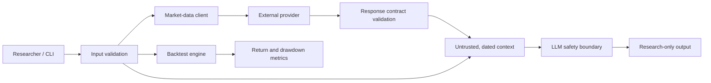

# Quant LLM Assistant

[](https://github.com/CoreyLeath-code/QUANT-LLM-ASSISTANT/actions/workflows/ci.yml)
[](https://www.python.org/)
[](#quality-gates)
[](https://docs.astral.sh/ruff/)
[](https://mypy.readthedocs.io/)
[](https://bandit.readthedocs.io/)
[](https://www.docker.com/)
[](LICENSE)

A guardrailed command-line assistant for quantitative research. It validates external market data,
adds dated observations to an explicit LLM trust boundary, and provides a deterministic backtester
for research examples. It does **not** execute orders, manage portfolios, or provide personalized
investment advice.

> **Status:** Production-hardened research CLI. The core package, CI gates, and container are
> operational. Automated deployment is intentionally disabled until a target environment, registry,
> secret store, and approval policy are selected.

## Why this repository exists

Financial AI systems combine two unreliable boundaries: external market feeds and probabilistic
model output. This project demonstrates how to make those boundaries explicit and testable:

- fail closed on malformed, throttled, or provider-error market data;
- keep credentials out of source, logs, exceptions, and model context;
- distinguish observed facts from estimates and generated interpretation;
- constrain backtest inputs so invalid data cannot silently become a performance claim;
- enforce quality, security, coverage, performance, and container checks on every pull request.

## Capabilities and non-goals

| Area | Included | Explicitly out of scope |
| --- | --- | --- |
| Market data | Validated daily and intraday Alpha Vantage responses | Feed normalization across vendors |
| LLM analysis | OpenAI-compatible chat boundary with research-only policy | Autonomous agents or trade execution |
| Backtesting | Single-instrument, one-unit long/flat/short examples | Fees, slippage, liquidity, taxes, corporate actions |
| Delivery | CLI, Python modules, Docker image, CI smoke test | Public API, UI, or automatic production deploy |
| Operations | Timeouts, bounded retries, exit codes, runbook/SLO guidance | Hosted telemetry backend or on-call integration |

## Architecture



### Request lifecycle

1. Normalize and validate the symbol, query size, interval, output size, URL, and timeout.
2. Call the market provider over HTTPS with an explicit deadline.
3. Reject non-object payloads, provider errors, throttling notices, and missing time-series fields.
4. Label the dated observation as untrusted context before sending it to the model.
5. Require the model to separate facts from estimates, state limitations, and include a
   research-only disclaimer.
6. Return output to the caller; never submit an order or mutate a brokerage account.

## Repository map

| Path | Responsibility |
| --- | --- |
| `src/config.py` | Lazy environment loading, HTTPS validation, and bounded timeouts |
| `src/data_client.py` | Market-data validation, provider contracts, and safe failures |
| `src/llm_agent.py` | OpenAI client boundary and financial-research system policy |
| `src/backtest.py` | Deterministic strategy simulation and risk statistics |
| `src/main.py` | CLI argument parsing and context assembly |
| `src/mcp_client.py` | Allowlisted, configuration-driven external tool calls |
| `tests/test_core.py` | Positive, negative, boundary, and failure-path tests |
| `benchmarks/` | Deterministic latency regression budget |
| `docs/production-readiness.md` | SLOs, rollout, rollback, and incident response |
| `.github/workflows/ci.yml` | Required quality, security, and container gates |

## Quick start

### Prerequisites

- Python 3.11+
- An OpenAI API key
- An Alpha Vantage API key when using `--symbol`
- Docker only for the container workflow

### Local installation

```bash
git clone https://github.com/CoreyLeath-code/QUANT-LLM-ASSISTANT.git
cd QUANT-LLM-ASSISTANT
python -m venv .venv
```

Activate the environment:

```bash
# macOS / Linux
source .venv/bin/activate

# Windows PowerShell
.venv\Scripts\Activate.ps1
```

Install the package and development tools:

```bash
python -m pip install --upgrade pip "setuptools>=83"
pip install -e ".[dev]"
```

### Configuration

Copy `.env.example` to `.env` and populate only the credentials you need:

```dotenv
OPENAI_API_KEY=
DATA_API_KEY=
DATA_API_BASE_URL=https://www.alphavantage.co/query
OPENAI_API_BASE=https://api.openai.com/v1
REQUEST_TIMEOUT_SECONDS=10
```

| Variable | Required | Default | Constraints |
| --- | --- | --- | --- |
| `OPENAI_API_KEY` | For model queries | None | Keep in a secret manager outside local development |
| `DATA_API_KEY` | When `--symbol` is used | None | Read-only market-data credential |
| `DATA_API_BASE_URL` | No | Alpha Vantage HTTPS endpoint | HTTPS, hostname required, no embedded credentials |
| `OPENAI_API_BASE` | No | OpenAI v1 HTTPS endpoint | HTTPS, hostname required, no embedded credentials |
| `REQUEST_TIMEOUT_SECONDS` | No | `10` | Greater than 0 and at most 60 seconds |

Configuration is validated at the point of use. Importing the package does not require secrets.

## Usage

Ask a general research question:

```bash
python -m src.main --query "Explain the limitations of a simple momentum backtest"
```

Add validated, dated market context:

```bash
python -m src.main \
  --symbol AAPL \
  --query "Summarize the observed close and identify what cannot be inferred from it"
```

Display CLI options without credentials or network calls:

```bash
python -m src.main --help
```

### Backtest example

```python
import pandas as pd

from src.backtest import BacktestEngine

prices = pd.DataFrame(
    {"close": [100.0, 103.0, 101.0]},
    index=pd.date_range("2026-01-01", periods=3),
)


def always_long(frame: pd.DataFrame) -> pd.Series:
    return pd.Series(1, index=frame.index)


engine = BacktestEngine(prices, always_long, initial_cash=10_000)
equity = engine.run()
metrics = engine.stats()
```

Positions must be `-1`, `0`, or `1` and align exactly with validated, ordered, positive price data.
Results are research examples and omit real-market execution effects.

## Trust boundaries and threat model

| Boundary | Primary risk | Control |
| --- | --- | --- |
| CLI input | Injection, oversized prompts, invalid tickers | Length, character, and enum validation |
| Environment | Missing or leaked credentials | Lazy validation; no secret values in errors |
| Market provider | Schema drift, throttling, deceptive payloads | HTTPS, timeout, status and response-contract checks |
| MCP configuration | SSRF or parameter expansion | Host allowlist and declared-parameter enforcement |
| LLM provider | Prompt injection, unsupported certainty, empty output | System policy, untrusted-context labeling, bounded generation |
| Backtest | Look-ahead-like misalignment or invalid pricing | Ordered unique index, aligned signals, positive finite closes |
| CI and supply chain | Regressions or vulnerable dependencies | Read-only token, SAST, dependency audit, immutable image tag |

Security reports should avoid public issues when they contain exploit details or credentials. Revoke
suspected exposed keys immediately, stop affected jobs, rotate secrets, and review provider audit
logs. Operational response procedures are in
[`docs/production-readiness.md`](docs/production-readiness.md).

## Quality gates

The same commands used by CI can be run locally:

```bash
ruff check src tests
mypy src/config.py src/data_client.py src/llm_agent.py
python -m pytest
bandit -r src -q
pip-audit
python -m benchmarks.latency_benchmark --max-seconds 0.25
docker build -t quant-llm-assistant:local .
docker run --rm quant-llm-assistant:local --help
```

| Gate | Policy |
| --- | --- |
| Tests | Unit and failure-path tests must pass without live provider calls |
| Coverage | At least 90% across configuration, data, backtest, and LLM boundary modules |
| Lint | Ruff errors fail the build; no warning-to-success conversion |
| Types | Strict MyPy on external-boundary modules |
| Security | Bandit and `pip-audit` must report no blocking findings |
| Performance | Mean 1,000-row backtest latency must remain below a 250 ms CI budget |
| Container | Image build and `--help` smoke test must pass |

The latency threshold is a regression detector, not a production SLO or throughput claim. Current
results vary by runner and should be compared only under equivalent conditions.

## Container workflow

```bash
docker build -t quant-llm-assistant:local .
docker run --rm \
  --env-file .env \
  quant-llm-assistant:local \
  --query "Describe the model's research limitations"
```

For a production rollout, build an immutable image tagged with the commit SHA, use a managed secret
store, restrict egress to approved providers, canary with read-only credentials, and retain the prior
image for rollback. Kubernetes files in this repository are reference material until image registry,
runtime ownership, health checks, and environment-specific policy are defined.

## Operations and reliability

Recommended service-level indicators for an orchestrated deployment:

- successful research-job ratio, excluding confirmed upstream outages;
- p50/p95 provider and end-to-end latency;
- provider throttling, contract-validation, timeout, and model-empty-response rates;
- token usage and cost by model/version without storing prompt content;
- benchmark latency by commit and container startup failures.

The production-readiness guide proposes a 99% successful-job objective, alert thresholds, canary
promotion, rollback, credential-exposure response, and data-contract incident handling. Those are
starting policies and must be calibrated with real traffic before becoming contractual SLOs.

## Engineering decisions

- **Fail closed at external boundaries.** Incorrect financial context is more dangerous than no
  context, so malformed or throttled responses are not passed through.
- **Keep the core synchronous and small.** The current workload is a single CLI request; an async
  service would add complexity without measured concurrency requirements.
- **Separate research from execution.** There is intentionally no brokerage adapter, order model,
  position mutation, or approval bypass.
- **Do not auto-deploy an unspecified environment.** CI proves an artifact can be built; deployment
  requires an explicit owner, target, secrets, observability, and rollback authority.
- **Use generous performance budgets.** CI detects large regressions without presenting hosted-runner
  timing as a product benchmark.

## Known limitations

- Provider integrations are narrow and do not normalize calendars, corporate actions, or symbols.
- The backtester uses one-unit positions and omits fees, spread, slippage, borrow cost, liquidity,
  taxes, portfolio constraints, and survivorship bias.
- Generated analysis can still be incomplete or wrong; system instructions reduce risk but do not
  make model output authoritative.
- The CLI has no multi-tenant authentication, authorization, quotas, persistence, or hosted metrics.
- Kubernetes and Ansible assets require environment-specific validation before operational use.

## Roadmap

1. Add typed provider adapters with recorded contract fixtures and market-calendar normalization.
2. Add transaction-cost, slippage, portfolio, and benchmark models with golden-result tests.
3. Introduce structured, redacted telemetry and cost/latency dashboards.
4. Define a versioned HTTP API only after authentication, authorization, quota, and abuse models.
5. Add signed SBOM/provenance and environment-specific deployment promotion after ownership is set.

Roadmap items are directional, not delivery commitments.

## Contributing

See [`CONTRIBUTING.md`](CONTRIBUTING.md) and [`CODE_OF_CONDUCT.md`](CODE_OF_CONDUCT.md). Pull requests
should be focused, include tests for behavior and failure modes, preserve the trust boundaries above,
and pass every quality gate. Use conventional, imperative commit subjects and document operational
or security consequences in the PR description.

## License and disclaimer

Licensed under the [MIT License](LICENSE).

This software is provided for research and educational use. Nothing produced by this project is
investment, legal, accounting, or tax advice. Validate data and model output independently before
making financial decisions.
